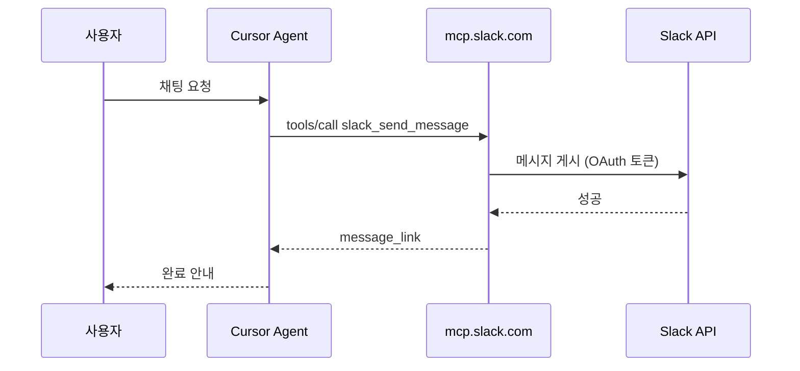

# MCP 프로토콜과 Slack 메시지 흐름

## `mcp://` 인가?

**아니다.** 일반 연결은 `mcp://(url)` 이 아니다.

- **원격:** `"url": "https://mcp.slack.com/mcp"` → **HTTPS** + MCP(JSON-RPC)
- **로컬:** `"command": "npx", ...` → **stdio** (stdin/stdout JSON)

`cursor://...` 는 Plugin **설치 deeplink**용이며, 메시지 전송 경로와는 별개다.

## MCP가 “시작”되는 방법

1. Cursor 실행
2. `mcp.json` 읽기
3. 각 서버에 연결 (HTTPS 또는 stdio)
4. `tools/list` 로 도구 목록 수신
5. Agent가 `tools/call` 로 도구 실행

사용자가 `mcp://` 를 입력해 시작하는 것이 아니다.

## 메시지 내용이 Slack까지 가는 경로

```text
① 채팅: "#alarmtest에 나는 lhj 보내줘"
        ↓
② Agent → MCP 도구 호출 (예: slack_send_message)
        channel_id = "C09PMHZUXUY"
        message    = "나는 lhj"
        ↓
③ HTTPS + JSON-RPC → https://mcp.slack.com/mcp
        ↓
④ Slack MCP 서버 → Slack Web API (HTTPS)
        ↓
⑤ #alarmtest 채널에 표시
```

**FastAPI가 아니다.** FastAPI는 MCP 서버를 Python으로 만들 때 쓸 수 있는 프레임워크 이름일 뿐, Slack 공식 MCP의 구현 기술을 뜻하지 않는다.

## HTTPS 구간 (두 번)

| 구간 | 내용 |
|------|------|
| Cursor → Slack MCP | HTTPS, MCP(JSON-RPC), `tools/call` |
| Slack MCP → Slack | HTTPS, Slack REST API |

Cursor가 `chat.postMessage` URL을 직접 호출하지 않는다.

## 시퀀스 (요약)


